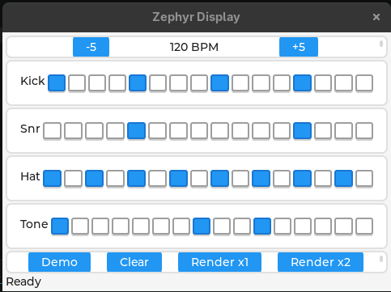

# beatbox

A very small Pocket-Operator-style step sequencer + synth for Zephyr.
uart0 is the interactive shell console; uart1 is a dedicated line that
streams the rendered audio out as raw 16-bit PCM, the way you'd route
audio to a real codec/DAC module over UART on actual hardware. An
LVGL touchscreen front panel gives you the same controls as the shell
commands, and both stay in sync with each other.



## Prerequisites

- A working Zephyr development environment (`west`, the Zephyr SDK,
  and a Zephyr workspace with `ZEPHYR_BASE` set up). If you don't
  have this yet, follow Zephyr's official Getting Started Guide:
  https://docs.zephyrproject.org/latest/develop/getting_started/index.html
- Python 3 (for the audio capture script, optional)

## Build & run

```bash
west build -b native_sim .
./build/zephyr/zephyr.exe
```

A window should open with the touchscreen UI: a BPM +/- pair, one
row of 16 toggle steps per track (Kick/Snr/Hat/Tone), and Demo /
Clear / Render buttons. Click steps to toggle them, click Render to
stream that pattern out uart1.

The shell is still there too, on the same terminal you launched from:

```
beatbox:~$ seq bpm 140
beatbox:~$ seq toggle 3 2
beatbox:~$ seq pattern_demo
beatbox:~$ seq clear
beatbox:~$ seq render 2
```

Either interface updates the other -- toggling a step on the
touchscreen changes what `seq toggle` would report, and running
`seq clear` in the shell clears the on-screen grid too.

## Capturing audio

Watch the boot log for a line announcing where uart1 landed, e.g.:

```
UART_1 connected to pseudo-tty: /dev/pts/7
```

(native_sim auto-creates a pseudo-tty per configured UART that isn't
explicitly redirected elsewhere.) In a second terminal, point the
capture script straight at that pty -- it monitors continuously and
plays back + saves each render as soon as it detects one finished:

```bash
python3 wav_capture.py /dev/pts/7
```

Then trigger a render from either the touchscreen or the shell:

```
beatbox:~$ seq render 2
```

You should hear it play back within about a second of finishing (it
uses a short silence-on-the-line timeout to know a sequence has
ended, since the stream itself has no end marker). Every sequence is
also saved to `captures/sequence_NNN.wav`.

Useful flags:
```bash
python3 wav_capture.py /dev/ttyUSB0 --baud 115200   # real hardware later
python3 wav_capture.py /dev/pts/7 --no-play         # save only, no playback
python3 wav_capture.py --from-file raw.bin out.wav  # convert an old capture
```

Playback tries `simpleaudio` first, then a platform command-line
player (`afplay`/`paplay`/`aplay`/PowerShell). `pip install
simpleaudio pyserial` gets you both reliable playback and proper
baud-rate handling if you move this to real UART hardware.

## Stream format

uart1 sends, per render: a 4-byte magic `"PSIM"`, a little-endian
`uint32` sample rate, then raw little-endian `int16` mono PCM samples
back-to-back until the render finishes. No other framing -- deliberately
close to what you'd actually push out a UART to a codec. `wav_capture.py`
detects "finished" via a short silence timeout on the line, since the
stream carries no explicit end marker.

## The UI

`ui.c` builds a row of 16 individually checkable buttons per track
(Kick/Snr/Hat/Tone) plus bpm/transport buttons, sized relative to the
screen rather than fixed pixels, and exposes only a `ui_callbacks_t`
struct to the rest of the app (see `ui.h`) -- it never reaches into
`sequencer_t` directly. `main.c` wires those callbacks to the same
`sequencer_*()` calls the shell commands use, and calls
`ui_sync_from_sequencer()` after every shell mutation so the two
front ends can't drift apart. `lv_timer_handler()` is pumped from a
plain loop in `main()`; it also drives the SDL mouse-as-touch input
on native_sim.

## The sounds

All four voices are pure integer math, no float, no lookup tables --
deliberately light enough for a Cortex-M0 with no FPU:

- **kick**: square wave, pitch sweeps 180 Hz -> 45 Hz over 120 ms,
  linear amplitude decay over 220 ms
- **snare**: 16-bit Galois LFSR noise + a short low square "body" tone
- **hihat**: same LFSR, stepped twice per sample for a denser/brighter
  feel, very short decay
- **tone**: plain 440 Hz square wave with a slow decay, for melodic
  accents

Mixing happens in a 32-bit buffer (`sequencer.c`) so four simultaneous
voices can't wrap an `int16_t` before the soft-clip stage.

## Porting to real hardware

`sequencer.c` / `synth.c` never touch a peripheral directly, so they
carry over unchanged, and `main.c` doesn't either -- it only calls
`audio_out_render_and_stream()`. Everything platform-specific about
audio output lives in `audio_out.c`, so that's the only file with
two options on real hardware:

- Keep uart1, point its devicetree node at an actual UART pin pair
  wired to a UART-input codec/DAC module -- `emit_uart1_chunk()`
  needs no changes at all.
- Swap it for a PWM/I2S/DAC driver call if your hardware has a proper
  audio peripheral instead -- same `emit_*_chunk(frames, count)`
  shape, different driver call inside, same `audio_out.h` contract
  so `main.c` doesn't change either way.

`ui.c` is similarly portable: it only assumes *some* LVGL display +
pointer/touch device exists, so pointing the devicetree `chosen
zephyr,display` at a real panel driver instead of `sdl_dc` is the
only change needed to move the touchscreen UI to hardware.

Natural next steps once this is running:
- Real buttons via GPIO as a third front end alongside shell + touch
- More voices per track, or per-step parameter locks (like the actual
  PO's "sub" mode)
- A "playing" indicator that highlights the current step live instead
  of only showing on/off state
